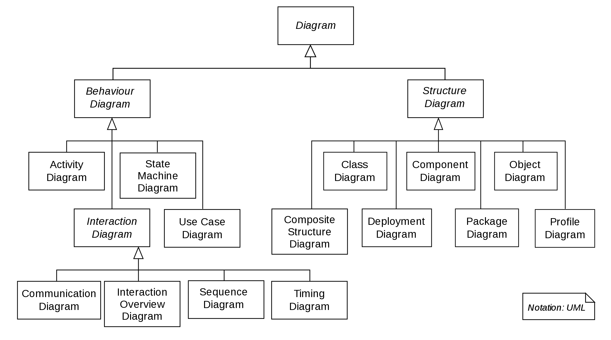

############################
|project| |release| designs.
############################

Number List.

#. Number-Item-1.
#. Number-Item-2.

Following directives works fine width ``docx`` builder.

Image-1 below.

Image-1 above.

Image-2 below.

Image-2 above.

Image-3 below.

Image-3 above.

Image ``align`` values:

- ``top``
- ``middle``
- ``bottom``
- ``left``
- ``center``
- ``right"``

The values "top", "middle", and "bottom" control an image's vertical alignment (relative to the text baseline)
they are only useful for inline images (substitutions).
The values "left", "center", and "right" control an image's horizontal alignment,
allowing the image to float and have the text flow around it. The specific behavior depends upon the browser or rendering software used.

.. doxygenclass:: exqudens::Strings
  :project: main
  :members:
